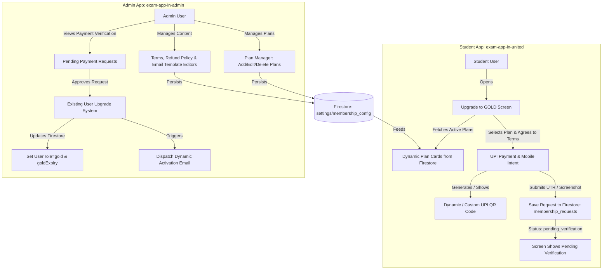

# Implementation Plan: Dynamic GOLD Membership Upgrade, UPI Payment Flow & Admin Integration

This document outlines the complete architectural design and implementation specification for the **GOLD Membership Upgrade Feature**, separating responsibilities between the **Student App (`exam-app-in-united`)** and the **Admin App (`exam-app-in-admin`)**.

---

## Architecture Overview & Multi-App Division



---

## Key System Components & Features

### 1. Student App (`exam-app-in-united`)

- **Dynamic Upgrade Screen (`UpgradeGoldScreen.jsx`)**:
  - **Dynamic Plan Rendering**: Reads subscription plans directly from Firestore (`settings/membership_config`). Renders all active plans dynamically (e.g. 1 Month, 3 Months, 6 Months, 12 Months, or any custom plan created in the Admin App).
  - **Terms & Refund Policy**: Renders scrollable Terms & Conditions and Refund Policy fetched live from Admin configuration with mandatory agreement checkbox.
  - **Dynamic UPI Payment & Mobile Intent**:
    - Generates dynamic UPI QR Code based on selected plan price (`upi://pay?pa=<UPI_ID>&pn=<PAYEE_NAME>&am=<SELECTED_PLAN_PRICE>&tn=Gold_Membership_<PLAN_ID>&cu=INR`) or displays custom plan QR uploaded by admin.
    - Displays Payee UPI ID with 1-click copy button.
    - Mobile UPI Intent Button: `<a href="upi://pay?pa=...&am=...">Pay via UPI App (GPay / PhonePe / Paytm)</a>` for Android mobile devices.
  - **Payment Verification Submission Form**:
    - Input fields for UTR / Transaction Reference ID and payment screenshot link.
    - Direct "Send via Email" fallback button.
    - Submits record to Firestore `membership_requests` collection and sets user status to `pending_verification`.
  - **State-Driven Display**:
    - Standard State → Upgrade & Payment Options.
    - Pending State → Shows submitted UTR, selected plan details, and verification notice.
    - Active GOLD State → Shows active membership details, start date, expiry date, and unlocked privileges.

- **Profile & Router Integration**:
  - Update `ProfileScreen.jsx` to route to `/upgrade` when tapping Upgrade/Manage Membership.
  - Show pending verification status banner on Profile if request is awaiting review.

---

### 2. Admin App (`exam-app-in-admin`)

- **Dynamic Plan Manager (Add / Edit / Delete Plans)**:
  - Admin UI tab allowing complete CRUD management of membership plans.
  - Plan attributes: `id`, `title`, `durationMonths`, `price`, `description`, `badge` (e.g., "Most Popular", "Best Value"), `qrUrl` (optional custom QR override), `isActive` toggle.
  - Ability to add new plans, modify existing prices/durations, toggle visibility, or delete legacy plans.

- **Integration with Existing Admin User Upgrade System**:
  - Integrate payment verification into the existing user management system in `exam-app-in-admin`.
  - Admin can inspect pending payment requests (`membership_requests` collection) alongside user profiles.
  - Clicking **"Approve & Upgrade User"** links into the existing upgrade logic:
    - Sets user `role` to `'gold'`.
    - Sets `goldStartAt` (current timestamp) and calculates `goldExpiry` (current date + plan duration months).
    - Updates request status to `approved`.
    - Triggers automated activation email dispatch.

- **Terms, Refund Policy & Email Template Editors**:
  - Rich text editor for Terms & Conditions and Refund Policy.
  - Email Template Editor for:
    1. **Payment Submission Acknowledgment Email**
    2. **Membership Activation Email**
  - Supported Dynamic Tags: `{{user_name}}`, `{{user_email}}`, `{{plan_name}}`, `{{duration}}`, `{{amount}}`, `{{utr_number}}`, `{{start_date}}`, `{{expiry_date}}`.

---

## 3. Shared Firestore Data Models

#### A. `settings/membership_config`
```json
{
  "upiId": "medforum@upi",
  "payeeName": "MedForum Pediatrics",
  "termsAndConditions": "Editable terms text...",
  "refundPolicy": "Editable refund policy text...",
  "plans": [
    {
      "id": "plan_3m",
      "title": "3 Months Gold",
      "durationMonths": 3,
      "price": 2999,
      "badge": "Popular",
      "description": "Full access to Gold Answers & Question Bank for 3 Months",
      "qrUrl": "",
      "isActive": true
    },
    {
      "id": "plan_6m",
      "title": "6 Months Gold",
      "durationMonths": 6,
      "price": 4999,
      "badge": "Best Value",
      "description": "Full access to Gold Answers & Question Bank for 6 Months",
      "qrUrl": "",
      "isActive": true
    }
  ],
  "emailTemplates": {
    "paymentReceived": {
      "subject": "Payment Received for {{plan_name}} - Verification Pending",
      "body": "Hello {{user_name}},\n\nWe received your payment request of ₹{{amount}} for {{plan_name}} with UTR: {{utr_number}}.\nOur admin team is verifying your payment and your GOLD membership will be activated shortly."
    },
    "membershipActivated": {
      "subject": "🎉 Welcome to GOLD Membership - PediaQ!",
      "body": "Hello {{user_name}},\n\nGreat news! Your {{plan_name}} has been activated successfully.\n\nActivation Date: {{start_date}}\nExpiry Date: {{expiry_date}}\n\nEnjoy unlimited access to all Gold Question Banks and Answer Keys."
    }
  }
}
```

#### B. `membership_requests`
```json
{
  "id": "req_98765",
  "userId": "uid_user_123",
  "userName": "Dr. Smith",
  "userEmail": "smith@example.com",
  "userMobile": "+91 9876543210",
  "planId": "plan_3m",
  "planTitle": "3 Months Gold",
  "amount": 2999,
  "utrNumber": "UTR123456789",
  "status": "pending_verification", // pending_verification | approved | rejected
  "createdAt": "2026-09-12T03:25:00Z"
}
```

---

## Future Execution Workflow

When you are ready to implement this feature:
1. **Student App (`exam-app-in-united`)**: Create `src/app/screens/UpgradeGoldScreen.jsx`, update router in `App.jsx`, link Profile button in `ProfileScreen.jsx`, and wire Firestore read/write listeners in `AppContext.jsx`.
2. **Admin App (`exam-app-in-admin`)**: Implement the Plan Manager, Terms/Refund editor, Email template editor, and link payment request approvals into the existing User Upgrade module.
