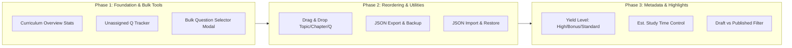

# 🗺️ PediaQ Admin Curriculum Builder — Enhancements Roadmap

> **System Goal:** Provide a powerful, scalable, and intuitive curriculum management system for administrators to effortlessly organize, structure, analyze, and optimize medical exam study material (DNB, DCH, MD Pediatrics).

---

## 📊 Status Matrix

| Phase | Feature Suite | Status | Key Deliverables |
| :--- | :--- | :---: | :--- |
| **Phase 1** | Stats, Tracking & Bulk Operations | ✅ Completed | Overall stats, Unassigned Q tracker, Topic badges, Bulk Question Selector modal |
| **Phase 2** | Drag & Drop Reordering + Backup | ✅ Completed | HTML5 Drag & Drop (Topics, Chapters, Qs), JSON Export/Import backup utilities |
| **Phase 3** | Metadata Controls & Student Highlights | ✅ Completed | Yield Level (High/Bonus), Est. Time, Draft/Published toggle, Draft filtering |
| **Phase 4** | Smart Analytics & Coverage Heatmaps | ⏳ Next Up | Difficulty breakdown, Question recency tracker, Topic gap analysis reports |
| **Phase 5** | Batch Operations & Multi-Track Plans | 📋 Planned | Batch publish/draft, Chapter cloning, Exam-specific curriculum variants |
| **Phase 6** | AI Auto-Categorization & Prerequisites | 📋 Planned | AI chapter suggestions, Prerequisite mapping, AI summary generation |
| **Phase 7** | Custom Learning Paths & Exam Tracks | 📋 Planned | MD / DNB / NEET-SS tracks, Dynamic study schedule builder |
| **Phase 8** | Revision History & Audit Logging | 📋 Planned | Change log tracking, Chapter snapshots & 1-click restore points |

---

## 🎯 Completed Implementation Summary (Phases 1 – 3)

---

## 🔮 Future Enhancement Roadmap (Phases 4 – 8)

### 📍 Phase 4: Smart Curriculum Analytics & Coverage Heatmaps
> **Focus:** Actionable insights into curriculum balance and question quality

- **Difficulty Breakdown Matrix**:
  - Visual distribution of Easy / Medium / Hard questions per topic and chapter.
  - Warn admins when a chapter has 0 hard or 0 standard questions.
- **Content Recency & Stale Question Tracker**:
  - Highlight questions that haven't been reviewed or updated in > 12 months.
  - Identify chapters with outdated clinical guidelines.
- **Topic Gap Analysis Report**:
  - Flag topics with `< 10` total questions or missing high-yield content.
  - One-click list of topics that need question creation priority.

---

### 📍 Phase 5: Advanced Batch Operations & Curriculum Variants
> **Focus:** High-efficiency administrative workflows for large question banks

- **Multi-Select Batch Actions**:
  - Select multiple chapters to **Batch Publish**, **Batch Draft**, or **Batch Change Yield Level**.
  - Batch move chapters between topics with a target topic selector.
- **Curriculum Map Cloning & Variants**:
  - Clone existing curriculum maps to create target exam tracks:
    - *30-Day DNB Rapid Revision Track* (Filters only High Yield & Gold Qs)
    - *Full DCH / MD 1-Year Comprehensive Track*
- **Admin Search & Filter Bar**:
  - Live search across topics, chapter names, and assigned question text directly inside the Admin Builder.
  - Filter chapters by status (`Draft Only`, `High Yield Only`, `Empty Chapters`).

---

### 📍 Phase 6: AI-Assisted Curriculum & Auto-Categorization
> **Focus:** Harness Gemini / Firebase AI Logic to speed up curriculum creation

- **AI Question Auto-Categorizer**:
  - Analyze unassigned question stems and automatically suggest the best topic and chapter.
  - One-tap "Accept AI Recommendation" button in unassigned question manager.
- **AI Prerequisite & Dependency Mapper**:
  - Recommend study sequences (e.g. *Read "Fetal Circulation" before "Congenital Heart Defects"*).
- **AI Chapter Executive Summaries**:
  - Auto-generate concise 3-bullet key takeaways for each chapter based on its question content.

---

### 📍 Phase 7: Custom Learning Paths & Exam-Specific Tracks
> **Focus:** Personalization for different medical board exams

- **Exam Tagging per Chapter**:
  - Tag chapters with target exams (`DNB Pediatrics`, `MD Pediatrics`, `DCH`, `NEET-SS Paediatrics`).
- **Dynamic Study Plan Generator**:
  - Auto-generate day-by-day study calendars for students based on exam date and available hours.

---

### 📍 Phase 8: Audit Logging, Revision History & Rollbacks
> **Focus:** Security, accountability, and error recovery

- **Change Log Tracking**:
  - Record admin actions (e.g. *"Admin John published Chapter Neonatal Jaundice at 10:45 AM"*).
- **Chapter Snapshots & Restore Points**:
  - Save historical snapshots of `curriculumMap` before major edits.
  - 1-click rollback to revert accidental deletions or unwanted re-orderings.

---

## 📁 Key Source Files

- Admin Builder Component: [`AdminPanel.jsx`](file:///d:/webprojects/PediaQApp/exam-app-sso/src/app/components/AdminPanel.jsx)
- Student Chapter View: [`ChapterStudyScreen.jsx`](file:///d:/webprojects/PediaQApp/exam-app-sso/src/app/screens/ChapterStudyScreen.jsx)
